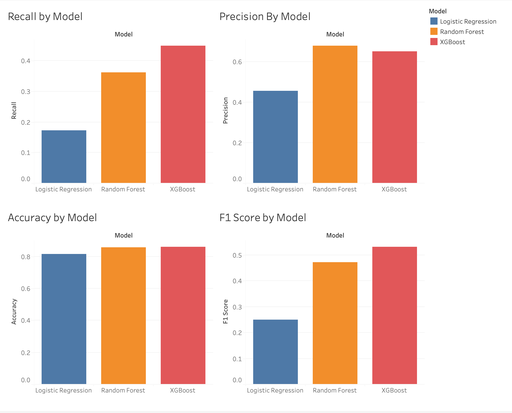

# 🧠 Sarcopenia Risk Prediction System

This project compares multiple machine learning models to predict **sarcopenia**, a condition related to age-related muscle loss. Using real-world medical survey data, the goal was to find the most effective diagnostic model.

## 🔍 Project Overview

Three models were tested:
- **Logistic Regression**
- **Random Forest**
- **XGBoost**

Each model was evaluated using:
- **Accuracy**
- **Precision**
- **Recall**
- **F1 Score**

## 📊 Model Comparison Dashboard

## ✅ Final Results

| **Model**            | **Accuracy** | **Precision** | **Recall** | **F1 Score** |
|----------------------|--------------|---------------|------------|--------------|
| Logistic Regression  | 0.816        | 0.455         | 0.172      | 0.250        |
| Random Forest        | 0.856        | 0.677         | 0.362      | 0.472        |
| XGBoost              | 0.859        | 0.650         | 0.448      | 0.531        |

> 🎯 **XGBoost** outperformed the others based on F1 Score and Recall, making it the top candidate for deployment.

## ⚙️ Technologies

- **Python** (pandas, scikit-learn, xgboost, seaborn, matplotlib)
- **Tableau** for model metric visualization
- **ML Pipelines** for structured preprocessing and evaluation

## 👤 Author

Ali Hasan  
[GitHub](https://github.com/AliHasan-786) • [LinkedIn](https://www.linkedin.com/in/alihasan786/)
